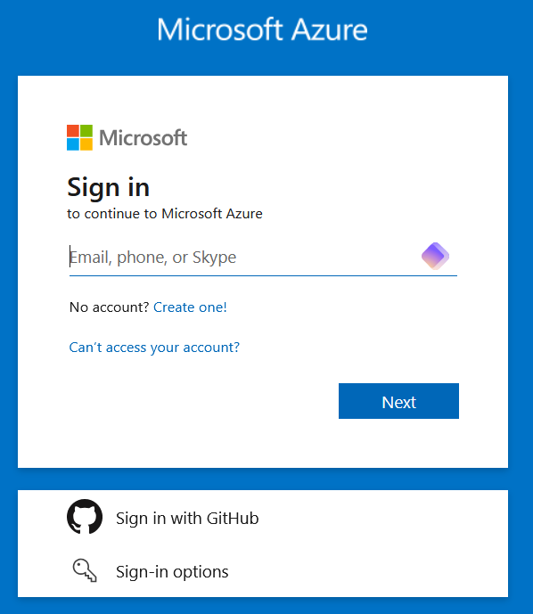

# Introduction to Azure Setup

When it comes to cloud computing, **Microsoft Azure** stands out as one of the most practical solutions for developing virtual networks and managing multiple virtual machines. While Azure offers a robust set of features and scalability, it's important to note that it may not be the best choice for those prioritizing *privacy*.

## Why Choose Azure?

- **Ease of Use**: Azure provides a user-friendly interface that simplifies the process of setting up and managing *virtual networks*. 

- **Scalability**: With Azure, you can quickly scale your resources up or down based on your needs. 

- **Cost-Effective**: Azure offers free services for students.


  ## Privacy Considerations
  While Azure is a powerful platform, it's essential to be aware of its privacy implications. As a cloud service, your data is stored on Microsoft’s servers, which may raise concerns for those who prioritize data privacy and security. **Do not store sensitive data on Azure**.


**Ready to dive into Azure?** Let's get started with the setup process!

## Prerequisites

### Step 1: Create an Azure Account/Sign In

Go to the [Azure portal](https://portal.azure.com/) and sign in with your Microsoft account. If you don't have an account, you can create one for free.


  Student accounts are eligible for free Azure services. Make sure to check the [Azure for Students](https://azure.microsoft.com/en-us/free/students/) page for more information.


 